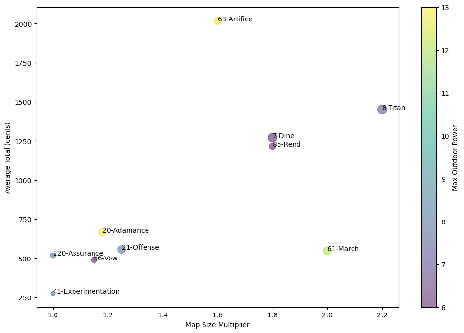

# Lethal Company v50 - Profitability Report


```python
import random
import numpy as np
import pandas as pd
```

### Interactive tables

Effortlessly view, navigate, sort, and filter data. Create charts and access essential data insights, including descriptive statistics and missing values – all without writing a single line of code.


```python
# Defining data for the dataframe
df = pd.read_csv('moons.csv')
df['Mean Loot'] = (df['Min Scrap'].astype(int) + df['Max Scrap'].astype(int)) / 2
```

### Visualization in DataSpell

Create graphs and visualizations that match your chosen color scheme.


```python
import math


# Number of attempts
def select_random_items(data, random_items_n):
    spawn_chances = data['Spawn Chance'].str.replace('%', '').astype(float) / 100
    items = data['Item'].values
    random_items_n = math.floor(random_items_n)
    selected_items = random.choices(items, weights=spawn_chances, k=random_items_n)
    return selected_items

# Function to calculate the total based on average price of selected items
def calculate_total(data, selected_items):
    avg_prices = data.set_index('Item')['Average Value (c)'].astype(str).str.replace(' ▮', '').astype(float)
    total = sum(avg_prices.loc[item] for item in selected_items)
    return total

# Function to run the simulation 100 times and calculate the average total
def run_simulation(data, random_items_n, num_runs=100):
    totals = []
    for _ in range(num_runs):
        selected_items = select_random_items(data, random_items_n)
        total = calculate_total(data, selected_items)
        totals.append(total)
    avg_total = sum(totals) / num_runs
    return avg_total
```


```python
results = []

for _, moon in df.iterrows():
    moon_name = moon['Name'] + '.csv'
    moon_mean_items = moon['Mean Loot']
    item_data = pd.read_csv(moon_name)
    avg_total = run_simulation(item_data, moon_mean_items)
    result = pd.DataFrame({'Moon': [moon['Name']], 'Average Total (cents)': [avg_total]})
    results.append(result)

combined_results = pd.concat(results, ignore_index=True)
```


```python
moons = df.join(combined_results.set_index('Moon'), on='Name')
moons['Average Total minus Cost'] = moons['Average Total (cents)'] - moons['Cost'].astype(float)
moons
```


<div>
<style scoped>
    .dataframe tbody tr th:only-of-type {
        vertical-align: middle;
    }

    .dataframe tbody tr th {
        vertical-align: top;
    }

    .dataframe thead th {
        text-align: right;
    }
</style>
<table border="1" class="dataframe">
  <thead>
    <tr style="text-align: right;">
      <th></th>
      <th>Name</th>
      <th>Difficulty</th>
      <th>Cost</th>
      <th>Default Layout</th>
      <th>Map Size Multiplier</th>
      <th>Min Scrap</th>
      <th>Max Scrap</th>
      <th>Max Indoor Power</th>
      <th>Max Outdoor Power</th>
      <th>Mean Loot</th>
      <th>Average Total (cents)</th>
      <th>Average Total minus Cost</th>
    </tr>
  </thead>
  <tbody>
    <tr>
      <th>0</th>
      <td>41-Experimentation</td>
      <td>Easy</td>
      <td>0</td>
      <td>The Factory</td>
      <td>1.00</td>
      <td>8</td>
      <td>11</td>
      <td>4</td>
      <td>8</td>
      <td>9.5</td>
      <td>274.39</td>
      <td>274.39</td>
    </tr>
    <tr>
      <th>1</th>
      <td>220-Assurance</td>
      <td>Easy</td>
      <td>0</td>
      <td>The Factory</td>
      <td>1.00</td>
      <td>13</td>
      <td>15</td>
      <td>6</td>
      <td>8</td>
      <td>14.0</td>
      <td>518.36</td>
      <td>518.36</td>
    </tr>
    <tr>
      <th>2</th>
      <td>56-Vow</td>
      <td>Easy</td>
      <td>0</td>
      <td>The Factory</td>
      <td>1.15</td>
      <td>12</td>
      <td>14</td>
      <td>7</td>
      <td>6</td>
      <td>13.0</td>
      <td>488.58</td>
      <td>488.58</td>
    </tr>
    <tr>
      <th>3</th>
      <td>21-Offense</td>
      <td>Intermediate</td>
      <td>0</td>
      <td>The Factory</td>
      <td>1.25</td>
      <td>14</td>
      <td>17</td>
      <td>12</td>
      <td>8</td>
      <td>15.5</td>
      <td>554.66</td>
      <td>554.66</td>
    </tr>
    <tr>
      <th>4</th>
      <td>61-March</td>
      <td>Intermediate</td>
      <td>0</td>
      <td>The Factory</td>
      <td>2.00</td>
      <td>13</td>
      <td>16</td>
      <td>14</td>
      <td>12</td>
      <td>14.5</td>
      <td>546.45</td>
      <td>546.45</td>
    </tr>
    <tr>
      <th>5</th>
      <td>20-Adamance</td>
      <td>Intermediate</td>
      <td>0</td>
      <td>The Factory</td>
      <td>1.18</td>
      <td>16</td>
      <td>18</td>
      <td>13</td>
      <td>13</td>
      <td>17.0</td>
      <td>666.28</td>
      <td>666.28</td>
    </tr>
    <tr>
      <th>6</th>
      <td>85-Rend</td>
      <td>Hard</td>
      <td>550</td>
      <td>The Manor</td>
      <td>1.80</td>
      <td>18</td>
      <td>25</td>
      <td>10</td>
      <td>6</td>
      <td>21.5</td>
      <td>1214.66</td>
      <td>664.66</td>
    </tr>
    <tr>
      <th>7</th>
      <td>7-Dine</td>
      <td>Hard</td>
      <td>600</td>
      <td>The Manor</td>
      <td>1.80</td>
      <td>22</td>
      <td>25</td>
      <td>16</td>
      <td>6</td>
      <td>23.5</td>
      <td>1270.17</td>
      <td>670.17</td>
    </tr>
    <tr>
      <th>8</th>
      <td>8-Titan</td>
      <td>Hard</td>
      <td>700</td>
      <td>The Factory</td>
      <td>2.20</td>
      <td>28</td>
      <td>31</td>
      <td>18</td>
      <td>7</td>
      <td>29.5</td>
      <td>1450.27</td>
      <td>750.27</td>
    </tr>
    <tr>
      <th>9</th>
      <td>68-Artifice</td>
      <td>Hard</td>
      <td>1500</td>
      <td>The Manor</td>
      <td>1.60</td>
      <td>31</td>
      <td>37</td>
      <td>13</td>
      <td>13</td>
      <td>34.0</td>
      <td>2017.72</td>
      <td>517.72</td>
    </tr>
  </tbody>
</table>
</div>


```python
import matplotlib.pyplot as plt
# Create the scatter plot
fig, ax = plt.subplots(figsize=(12, 8))
scatter = ax.scatter(moons['Map Size Multiplier'], moons['Average Total (cents)'], c=moons['Max Outdoor Power'], s=moons['Max Indoor Power'] * 10, alpha=0.5, cmap='viridis')
plt.colorbar(scatter, label='Max Outdoor Power')
plt.xlabel('Map Size Multiplier')
plt.ylabel('Average Total (cents)')

# Add text labels for each data point
for i, name in enumerate(moons['Name']):
    ax.annotate(name, (moons['Map Size Multiplier'].iloc[i], moons['Average Total (cents)'].iloc[i]))

plt.show()
```


    

    


```python
# Convert relevant columns to numeric
moons[['Map Size Multiplier', 'Max Indoor Power', 'Max Outdoor Power', 'Average Total (cents)']] = moons[['Map Size Multiplier', 'Max Indoor Power', 'Max Outdoor Power', 'Average Total (cents)']].apply(pd.to_numeric, errors='coerce')
```


```python
# Create the line chart
fig, ax = plt.subplots(figsize=(12, 6))

# Map Size Multiplier
ax.plot(moons.index, moons['Map Size Multiplier'] * 10, marker='o', label='Map Size Multiplier * 10')

# Average Total (cents)
ax.plot(moons.index, moons['Average Total (cents)'] / 100, marker='s', label='Average Total (cents) / 100')

# Max Outdoor Power
ax.plot(moons.index, moons['Max Outdoor Power'], marker='v', label='Max Outdoor Power')

# Max Indoor Power
ax.plot(moons.index, moons['Max Indoor Power'], marker='^', label='Max Indoor Power')

ax.set_xticks(np.arange(len(moons)))
ax.set_xticklabels(moons['Name'], rotation=45, ha='right')
ax.set_xlabel('Name')
ax.set_ylabel('Value')
ax.set_title('Line Chart')
ax.legend()

plt.show()
```


    

    

